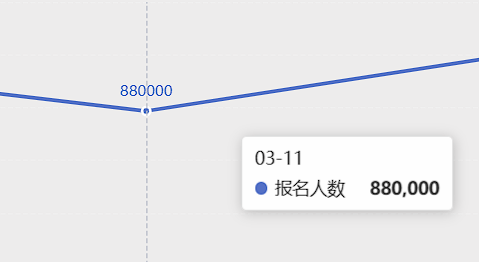
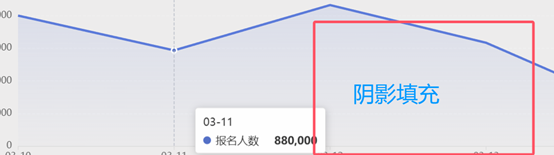
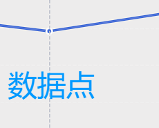
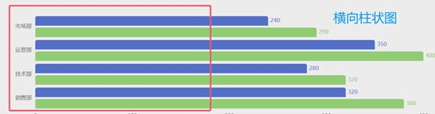
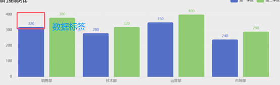

# LineChart.vue 折线组件属性细则

```typescript
showLabel: ture; //	是否显示数据标签
```

## 数据标签



## 区域填充

```typescript
 showArea: true, // 是否显示区域填充
```



## 数据点

```typescript
showSymbol: true, // 是否显示数据点
```



# BarChart.vue 柱状图组件

## 水平柱状图

```typescript
horizontal: true, // 是否水平柱状图
```



## 显示标签

```typescript
showLabel: true, // 是否显示标签 （默认显示）
```


